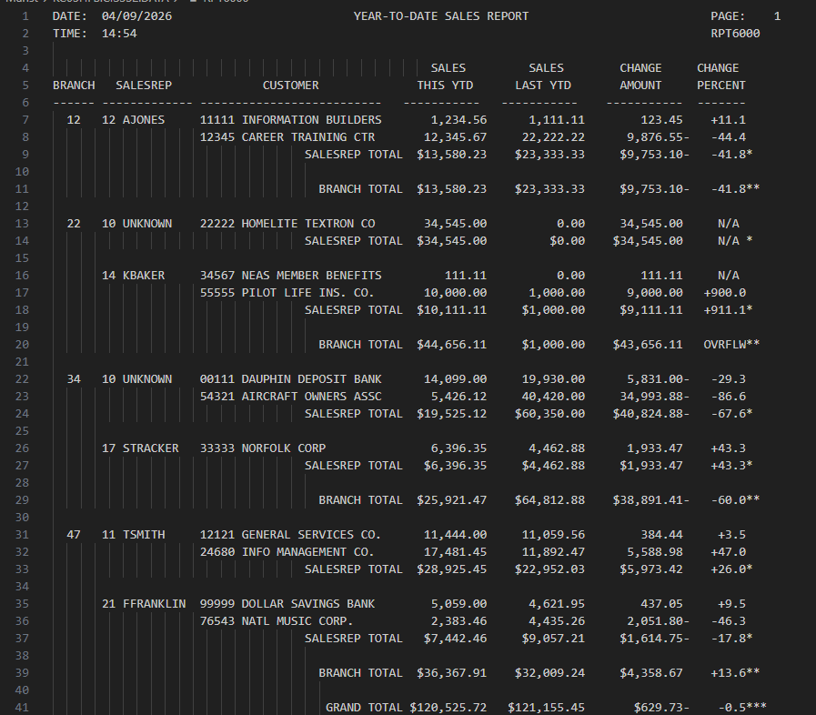

#  RPT6000 – Year-To-Date Sales Report V6

## Course Information
**Course:** CIS352 – Intro to Enterprise Computing  
**Assignment:** Chapters 6, 10, & 11  
**Date:** April 9th 2026  

---

## Table of Contents
* [Project Overview](#project-overview)
* [Features](#features)
* [Key Concepts](#key-concepts-implemented)
* [Workflow](#program-workflow)
* [Output](#output)
* [Authors](#authors)
---

## Project Overview

The **RPT6000 program** is a COBOL-based report system built from RPT5000.  
It generates a **Year-To-Date Sales Report** that displays:

- Branch information  
- Sales representative (SALESREP) names  
- Customer data  
- Sales totals (current and previous year)  
- Change amounts and percentages  

This version introduces more advanced COBOL concepts such as:
- `REDEFINES`
- Table processing with indexes
- File handling for dynamic data loading
- COPY libraries for modular design

---

## Features

- Formatted multi-line report output
- Sales comparisons (This YTD vs Last YTD)
- Dynamic SALESREP name lookup from file
- Calculated totals:
  - Salesrep totals
  - Branch totals
  - Grand totals
- Special value handling:
  - `"N/A"` for undefined percentages
  - `"OVRFLW"` for overflow conditions

---

## Key Concepts Implemented

### Chapter 6
- Use of `REDEFINES` for flexible data formatting
- Packed decimal usage at group level
- Handling special values (`N/A`, `OVRFLW`)
- Initialization of totals

### Chapter 10
- Table creation for SALESREP names
- Use of indexing instead of subscripts
- Dynamic lookup of SALESREP names

### Chapter 11
- Use of COPY libraries
- Separation of data structures into reusable components
- JCL updates to include `COBOL.SYSLIB`

---

## Program Workflow

1. Initialize variables and tables  
2. Load SALESREP data from input file  
3. Read customer sales records  
4. Match SALESREP numbers to names  
5. Perform calculations:
   - Sales totals
   - Change amounts
   - Percent changes  
6. Format and print report lines  
7. Output totals at SALESREP, BRANCH, and GRAND levels  

---

## Output

---

## Authors
  
**Hayden Schmidt**

- **GitHub**: [Haschm05](https://github.com/Haschm05)
  
- **Email**: [haschm05@wsc.edu]

**Violet French**

- **GitHub**: [Violet French](https://github.com/Pirategirl9000)
  
- **Email**: [BraedynFrench@gmail.com]

### File Definitions
* `CUSTMAST` - The name of the input file
  * `CUSTOMER-MASTER-RECORD` - A record containing all the information about each customer
* `ORPT6000` - The COBOL alias for the output file which is RPT6000
  * `PRINT-AREA` - 130 size picture clause for writing to the file

### Notable Data Items & Records
* `CUSTMAST-EOF-SWITCH` - Marks when the end of the file has been reached
* `PRINT-FIELDS` - Record containing information about the page including lines per page, current line, and page number
* `TOTAL-FIELDS` - Record containing information about the subtotals and grand totals for last YTD and this YTD
* `CURRENT-DATE-AND-TIME` - Record used for grabbing the current data and time via the CURRENT-DATE-AND-TIME function
* `CHANGE-AMOUNT` - Contains the difference in sales between last YTD and this YTD
* `HEADING-LINE-1` THRU `HEADING-LINE-6` - Records 130 character long used for outputting header lines for each page
* `CUSTOMER-LINE` - Record containing information about the current customer
  * `CL-BRANCH-NUMBER` - The branch number for this customer, only printed once for each branch
  * `CL-CUSTOMER-NAME` - The name of this customer
  * `CL-SALES-THIS-YTD` - Sales this year-to-date
  * `CL-SALES-LAST-YTD` - Sales last year-to-date
  * `CL-CHANGE-AMOUNT` - The difference between this year and last year's sales
  * `CL-CHANGE-PERCENT` - The percent difference between this year and last year's sales
* `GRAND-TOTAL-LINE-` AND `BRANCH-TOTAL-LINE` AND `SALESREP-TOTAL-LINE` - Record used for outputting the grandtotal and subtotal
  * `SALES-THIS-YTD` - Total sales for this year-to-date
  * `SALES-LAST-YTD` - Total sales last year-to-date
  * `CHANGE-AMOUNT` - The total difference between last year's sales and this years
  * `CHANGE-PERCENT` - The percentage difference between last year's sales and this years
 
### Notable Paragraphs
* `000-PREPARE-SALES-REPORT`
  * Opens and closes the IO files and delgates the work for reading/writing them
  * Serves as the entry point for the program
* `100-FORMAT-REPORT-HEADING`
  * Formats the header file by retrieving the date and moving it to the appropriate header lines
* `200-PREPARE-SALES-LINES`
  * Calls `210-READ-CUSTOMER-RECORD` to read the current record then if it's not the last record it calls `220-PRINT-CUSTOMER-LINE` to print the customer line
* `210-READ-CUSTOMER-RECORD`
  * Reads the next line of the customer records and if it's the end of file it moves 'Y' to `CUSTMAST-EOF-SWITCH`
* `220-PRINT-CUSTOMER-LINE`
  * Performs calculations for determining the values for the customer line before outputting them with the other customer information gathered from the input file
  * Also prints the corresponding subtotals if it is a new branch or salesrep
* `230-PRINT-HEADING-LINES`
  * Moves to the next page by resetting line count, incrementing page count, and reprinting header lines
* `240-PRINT-BRANCH-LINE`
  * Prints the current subtotals for this branch and adds them to the grand totals
* `250-PRINT-SALESREP-LINE`
  * Prints the current subtotals for this salesrep and adds them to the branch totals
* `300-PRINT-GRAND-TOTALS`
  * Calculates and prints the grand totals
 
## Credits
###### This program is an adaptation of a script provided by [Murach's Mainframe COBOL](https://www.murach.com/shop/murachs-mainframe-cobol-detail) and edited by [Debbie Johnson](https://github.com/dejohns2)
